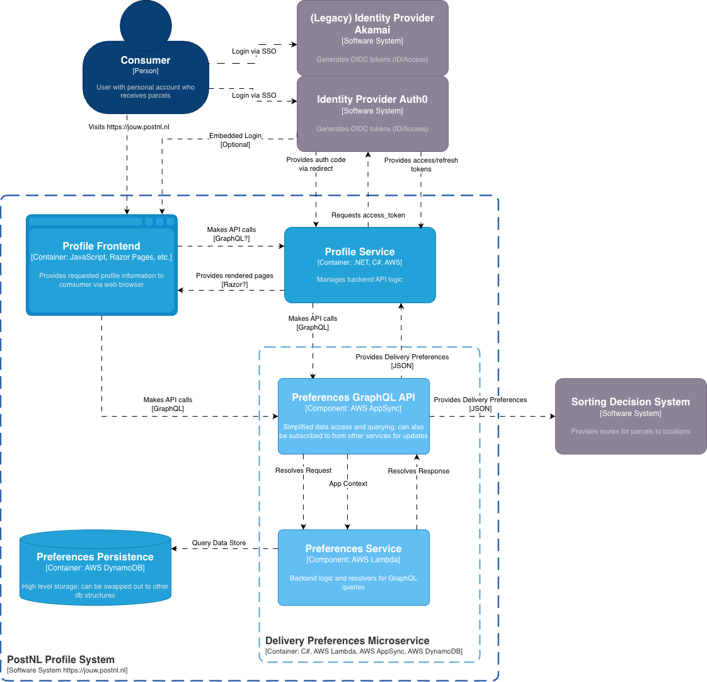
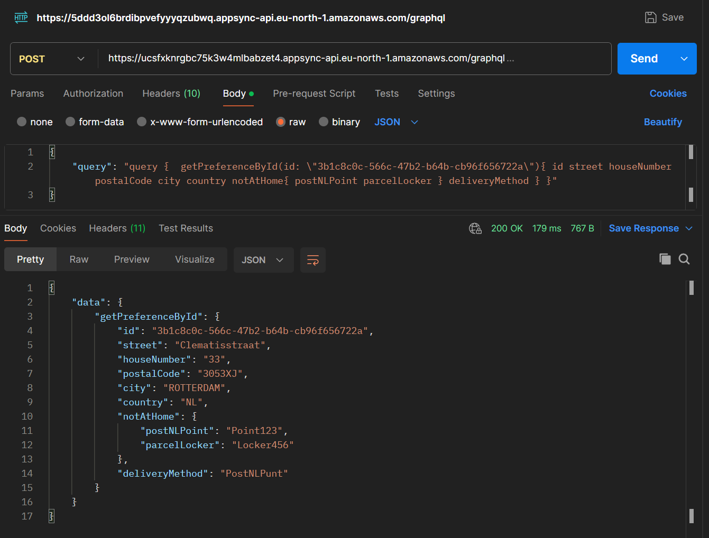
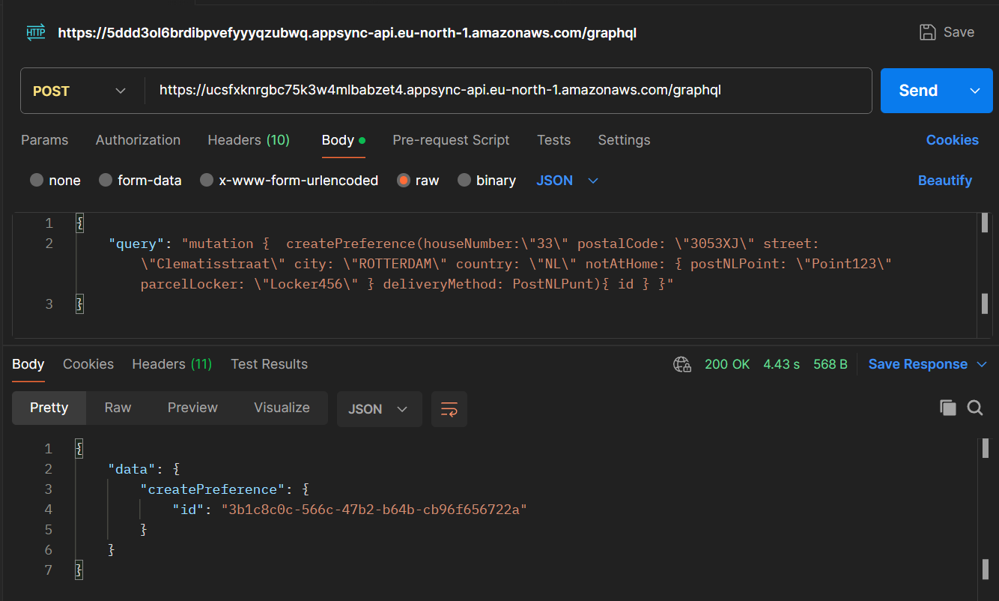

# Delivery Preference Case Study
#### @Author Austin Weidler

This microservice provides delivery preferences (and create/delete operations) for a given ID.

### The architecture of the system is displayed here in this C4 diagram:


----

### The Delivery Preferences Microservice
The microservice written in C# is hosted using [Amazon AWS](https://eu-north-1.console.aws.amazon.com/console/home?nc2=h_si&region=eu-north-1&src=header-signin#).
The infrastructure is built using a CloudFormation Stack which contains:
- Amazon Lambda Serverless Functions
- AppSync for GraphQL API query resolving
- DynamoDB Table

The solution is hosted on my private Amazon AWS account.

For sending GraphQL requests to test the service, use a HTTP client (like Postman):
```
HOST:
https://ucsfxknrgbc75k3w4mlbabzet4.appsync-api.eu-north-1.amazonaws.com/graphql

HEADERS:
x-api-key da2-25z2e2lovnf4pnbdsomoti5bju
Content-Type application/json
```

### Microservice GraphQL Query Examples

Getting a delivery preference
```
{
"query": "query {  getPreferenceById(id: \"3b1c8c0c-566c-47b2-b64b-cb96f656722a\"){ id street houseNumber postalCode city country notAtHome{ postNLPoint parcelLocker } deliveryMethod } }"
}
```



Creating a preference
```
{
"query": "mutation {  createPreference(houseNumber:\"33\" postalCode: \"3053XJ\" street: \"Clematisstraat\" city: \"ROTTERDAM\" country: \"NL\" notAtHome: { postNLPoint: \"Point123\" parcelLocker: \"Locker456\" } deliveryMethod: PostNLPunt){ id } }"
}
```

---
Note: No LLM coding tools were used for this solution

